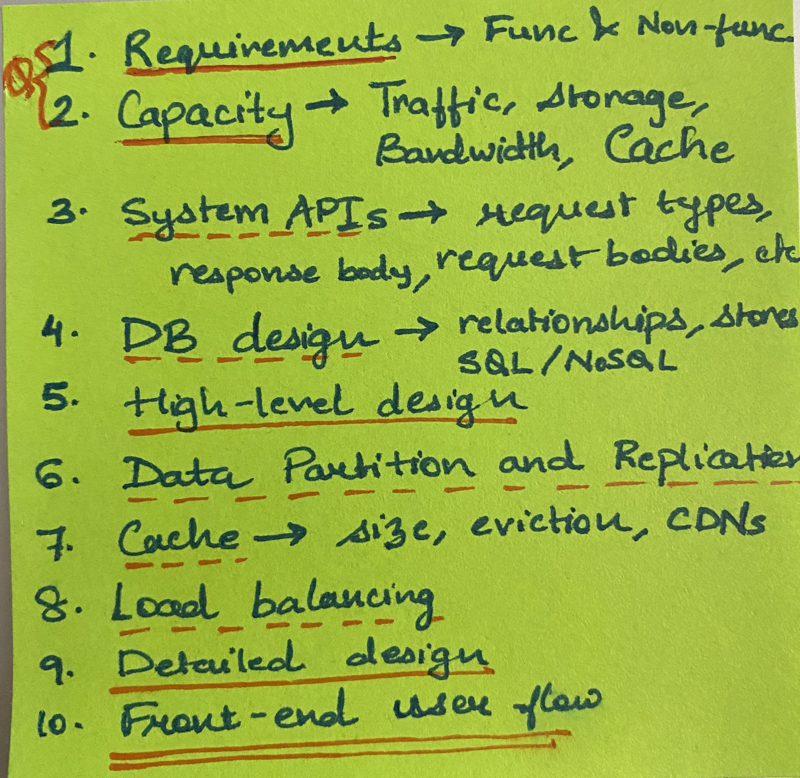

# System Design Prep

## Outline

1. Requirements, goals and scope
    - Functional requirements
    - Non-functional requirements
        - Reliability
        - Availability
        - Scalability
        - Latency (Response time)
        - Throughput (Bandwidth)
        - Privacy
        - Security
2. Capacity estimation and constraints
    - Trafffic estimates
        - Read-write ratio
    - Storage estimates
    - Bandwidth estimates
    - Memory estimates (Cache requirements)
3. System APIs
    - What type of request
    - JSON object bodies
    - Response objects
4. Database design
    - Observations about the data
        - Billions of records
        - Each record size
        - Relationships between records
        - Read/write heavy
    - DB schemas
        - Metadata store
        - Content store (Object storage, file storage, block storage)
        - Store to have access to content quickly, like timelines
    - NoSQL or SQL?
5. System Design and Algorithm
    - High level design
    - Detailed component design
        - Application Layer
        - Database Layer
    - Multiple approaches
6. Data Partition and Replication
    - Range based
    - Hash-based, Consistent Hashing
7. Cache
    - Cache size
    - Number of servers to fit cache
    - Cache eviction policy
    - Cache invalidation scheme
    - In memory cache VS (distributed) global cache

    [In-Process Caching vs. Distributed Caching - DZone Performance](https://dzone.com/articles/process-caching-vs-distributed)

8. Load balancing
    - Where all required?
    - Load balancing algorithm?
9. Detailed component design
10. Front-end connection with the backend

Thought process

## General Notes

1. MD5 hash function returns a 128-bit hash, represented by 32 hexadecimal digits.
2. Base64 ([a-z], [A-Z], [0-9], +, /) encoding uses 6 bits to represent a character value.  Base64 encoded strings of 6 characters has 68.7B possible strings.
3. **In-memory caches**

    The most potent–in terms of raw performance–caches you'll encounter are those which store their entire set of data in memory. [Memcached](http://memcached.org/) and [Redis](http://redis.io/) are both examples of in-memory caches (caveat: Redis can be configured to store some data to disk). This is because accesses to RAM are [orders of magnitude](http://en.wikipedia.org/wiki/RAM_disk) faster than those to disk.

    On the other hand, you'll generally have far less RAM available than disk space, so you'll need a strategy for only keeping the hot subset of your data in your memory cache. The most straightforward strategy is [least recently used](http://en.wikipedia.org/wiki/Cache_algorithms#Least_Recently_Used), and is employed by Memcache (and Redis as of 2.2 can be configured to employ it as well). LRU works by evicting less commonly used data in preference of more frequently used data, and is almost always an appropriate caching strategy.

4. Put vs Post request: 

    [What's the difference between a POST and a PUT HTTP REQUEST?](https://stackoverflow.com/a/107450/4989208)

## Rough calculations

8 bits = 1 byte
1 byte = 1 character
4 bytes = 1 integer (Java)

$2^{10} bytes = 1KB \qquad 10^{3} = 1KB $

$2^{20} bytes = 1MB \qquad 10^{6} = 1MB$

 $2^{30} bytes = 1GB \qquad 10^{9} = 1GB$$

## Consistent Hashing

[Consistent Hashing - Grokking the System Design Interview](https://www.educative.io/courses/grokking-the-system-design-interview/B81vnyp0GpY)

Drawbacks of commonly used hash-based partitioning (`key % n`):

1. Not horizontally scalable, as it requires all `k` keys to be remapped.
2. It may not be load balanced as the real data is not uniformly distributed.

We use consistent hashing to solve this problem. The idea is simple. We hash all servers, say 5, to an integer in the range, say [0, 256) and place them on a virtual ring. Then to map a given key to a sever, hash the key to a single integer. Move clockwise in the ring and map the key to the first server you encounter.

To add a new server, map it to another integer on the ring. Some of the keys from the nearby servers will then move to the new server. If any server fails, all the keys of that server then move to the next server. So, at max, only `k/n` severs need to be remapped.

For load balancing, we add virtual replicas of servers on the ring. Basically instead of mapping the server to just one integer, also map it to several points on the ring. Assuming the hash function to hash servers to integers "mixes well", the data on these servers will be partitioned uniformly. 

## Key Generation Service (KGS)

The application server will store the contents of the paste and the generated key in the database. After the successful insertion, the server can return the key to the user. One possible problem here could be that the insertion fails because of a duplicate key. Since we are generating a random key, there is a possibility that the newly generated key could match an existing one. In that case, we should regenerate a new key and try again. We should keep retrying until we don’t see failure due to the duplicate key. We should return an error to the user if the custom key they have provided is already present in our database.

Another solution of the above problem could be to run a standalone **Key Generation Service** (KGS) that generates random six letters strings beforehand and stores them in a database (let’s call it key-DB). 

1. Whenever we want to store a new paste, we will just take one of the already generated keys and use it. This approach will make things quite simple and fast since we will not be worrying about duplications or collisions. KGS will make sure all the keys inserted in key-DB are unique. 
2. KGS can use two tables to store keys, one for keys that are not used yet and one for all the used keys. As soon as KGS gives some keys to an application server, it can move these to the used keys table. 
3. KGS can always keep some keys in memory so that whenever a server needs them, it can quickly provide them. As soon as KGS loads some keys in memory, it can move them to the used keys table, this way we can make sure each server gets unique keys. 
4. If KGS dies before using all the keys loaded in memory, we will be wasting those keys. We can ignore these keys given that we have a huge number of them.
5. **Isn’t KGS a single point of failure?** Yes, it is. To solve this, we can have a standby replica of KGS and whenever the primary server dies it can take over to generate and provide keys.
6. **Can each app server cache some keys from key-DB?** Yes, this can surely speed things up. Although in this case, if the application server dies before consuming all the keys, we will end up losing those keys. This could be acceptable since we have 68B unique six letters keys, which are a lot more than we require.

## Load balancing algorithms

There is a variety of load balancing methods, which use different algorithms for different needs.

- **Least Connection Method** — This method directs traffic to the server with the fewest active connections. This approach is quite useful when there are a large number of persistent client connections which are unevenly distributed between the servers.
- **Least Response Time Method** — This algorithm directs traffic to the server with the fewest active connections and the lowest average response time.
- **Least Bandwidth Method** - This method selects the server that is currently serving the least amount of traffic measured in megabits per second (Mbps).
- **Round Robin Method** — This method cycles through a list of servers and sends each new request to the next server. When it reaches the end of the list, it starts over at the beginning. It is most useful when the servers are of equal specification and there are not many persistent connections.
- **Weighted Round Robin Method** — The weighted round-robin scheduling is designed to better handle servers with different processing capacities. Each server is assigned a weight (an integer value that indicates the processing capacity). Servers with higher weights receive new connections before those with less weights and servers with higher weights get more connections than those with less weights.
- **IP Hash** — Under this method, a hash of the IP address of the client is calculated to redirect the request to a server.
- **Consistent Hashing**

## Content Delivery Networks (CDNs)

CDNs are a kind of cache that comes into play for sites serving large amounts of static media. In a typical CDN setup, a request will first ask the CDN for a piece of static media; the CDN will serve that content if it has it locally available. If it isn’t available, the CDN will query the back-end servers for the file, cache it locally, and serve it to the requesting user.

## Cache invalidation schemes

1. **Write through cache**

    When "write hit", update both cache and memory with new data. This scheme prevents data loss during cache failures. But the writes become slower because of doubling the writes.

2. **Write back cache**

    When "write hit", update only the cache with new data. Update the storage only when the cache entry is going to get replaced by some other entry. This is done using a dirty bit for every entry. This scheme has a risk of data loss in the case of cache failure.

3. **Write around cache**

    When "write miss", update only the storage. This prevents large number of writes into the cache. But if the recently written data is read again, it will have a cache miss.

4. **Write allocation cache**

    When "write miss", bring the old data into the cache and update the cache entry. Use this along with either write back or write through.

## Cache eviction schemes

1. **Least Recently Used (LRU):** Discards the least recently used items first.
2. **Most Recently Used (MRU):** Discards, in contrast to LRU, the most recently used items first.
3. **Least Frequently Used (LFU):** Counts how often an item is needed. Those that are used least often are discarded first.
4. **Least Frequently Recently Used (LFRU):** Privileged and unprivileged sections. Frequently used are in privileged section. Replacement of the privileged partition is done as follows: LFRU evicts content from the unprivileged partition, pushes content from privileged partition to unprivileged partition, and finally inserts new content into the privileged partition
5. **Random Replacement (RR):** Randomly selects a candidate item and discards it to make space when necessary.
6. **First In First Out (FIFO):** The cache evicts the first block accessed first without any regard to how often or how many times it was accessed before.
7. **Last In First Out (LIFO):** The cache evicts the block accessed most recently first without any regard to how often or how many times it was accessed before.

## Cache coherance

In computer architecture, cache coherence is the uniformity of shared resource data that ends up stored in multiple local caches. When clients in a system maintain caches of a common memory resource, problems may arise with incoherent data, which is particularly the case with CPUs in a multiprocessing system.

The following are the requirements for cache coherence:

**Write Propagation -** Changes to the data in any cache must be propagated to other copies (of that cache line) in the peer caches.

**Transaction Serialization -** Reads/Writes to a single memory location must be seen by all processors in the same order.

Two common protocols used for cache coherence are Snooping protocol and directory based

## Data partitioning schemes

1. Horizontal partitioning (Range-based partitioning) → con: non-uniform distribution of data
2. Vertical partitioning → Feature based partitioning. con: How to further scale if a partitioned server needs to scale.
3. Hash-based partitioning → con: scaling required remapping → use consistent hashing
4. Directory-based partitioning → Have a lookup service that maintains a directory of where a particular data entry resides. Pro: can easily scale and change our partitioning scheme. Con: single point of failure, increased complexity.

## Problems of data partitioning

1. Joins and denormalization across partitions
2. Referential integrity across partitions
3. Rebalancing the partitions

## Indexes

Indexes are well known when it comes to databases. Sooner or later there comes a time when database performance is no longer satisfactory. One of the very first things you should turn to when that happens is database indexing.

The goal of creating an index on a particular table in a database is to make it faster to search through the table and find the row or rows that we want. Indexes can be created using one or more columns of a database table, providing the basis for both rapid random lookups and efficient access of ordered records.

[SQL - Indexes](https://www.tutorialspoint.com/sql/sql-indexes.htm)

[Single vs Composite Indexes in Relational Databases](https://medium.com/@User3141592/single-vs-composite-indexes-in-relational-databases-58d0eb045cbe)

[How does database indexing work?](https://stackoverflow.com/a/1130/4989208)

## SQL vs NoSQL

1. Schema

    Fixed schema in SQL, dynamic schema in NoSQL. Columns can be added on the fly and a row does not have to contain all the columns.

2. Scalability

    SQL is easy to scale vertically, but complicated to scale horizontally. NoSQL databases are horizontally scalable.

3. Reliability and ACID compliancy

    SQL is a safe bet when it comes to data reliability. Most of the NoSQL solutions sacrifice ACID compliance for scalability and performance. 

→ When data is structured and not changing very frequently, or when there is a need for an ACID-compliant database for critical data, use SQL.

→ When you need to scale horizontally to store huge data that is not necessarily structured and still have a fast and seamless database, or when you want to have rapid development and iterations, use NoSQL.

## Types of NoSQL databases

Following are the most common types of NoSQL:

**Key-Value Stores:** Data is stored in an array of key-value pairs. The ‘key’ is an attribute name which is linked to a ‘value’. Well-known key-value stores include Redis, Voldemort, and Dynamo.

**Document Databases:** In these databases, data is stored in documents (instead of rows and columns in a table) and these documents are grouped together in collections. Each document can have an entirely different structure. Document databases include the CouchDB and MongoDB.

**Wide-Column Databases:** Instead of ‘tables,’ in columnar databases we have column families, which are containers for rows. Unlike relational databases, we don’t need to know all the columns up front and each row doesn’t have to have the same number of columns. Columnar databases are best suited for analyzing large datasets - big names include Cassandra and HBase.

**Graph Databases:** These databases are used to store data whose relations are best represented in a graph. Data is saved in graph structures with nodes (entities), properties (information about the entities), and lines (connections between the entities). Examples of graph database include Neo4J and InfiniteGraph.

## CAP theorem

In [theoretical computer science](https://en.wikipedia.org/wiki/Theoretical_computer_science), the **CAP theorem**, also named **Brewer's theorem** after computer scientist [Eric Brewer](https://en.wikipedia.org/wiki/Eric_Brewer_(scientist)), states that it is impossible for a [distributed data store](https://en.wikipedia.org/wiki/Distributed_data_store) to simultaneously provide more than two out of the following three guarantees:

- [Consistency](https://en.wikipedia.org/wiki/Consistency_(database_systems)): Every read receives the most recent write or an error
- [Availability](https://en.wikipedia.org/wiki/Availability): Every request receives a (non-error) response, without the guarantee that it contains the most recent write
- [Partition tolerance](https://en.wikipedia.org/wiki/Network_partitioning): The system continues to operate despite an arbitrary number of messages being dropped (or delayed) by the network between nodes

When a network partition failure happens should we decide to

- Cancel the operation and thus decrease the availability but ensure consistency
- Proceed with the operation and thus provide availability but risk inconsistency

The CAP theorem implies that in the presence of a network partition, one has to choose between consistency and availability. Note that consistency as defined in the CAP theorem is quite different from the consistency guaranteed in [ACID](https://en.wikipedia.org/wiki/ACID) [database transactions](https://en.wikipedia.org/wiki/Database_transaction).

## HTTP Long-Polling

This is a variation of the traditional polling technique that allows the server to push information to a client whenever the data is available. With Long-Polling, the client requests information from the server exactly as in normal polling, but with the expectation that the server may not respond immediately. That’s why this technique is sometimes referred to as a “Hanging GET”.

- If the server does not have any data available for the client, instead of sending an empty response, the server holds the request and waits until some data becomes available.
- Once the data becomes available, a full response is sent to the client. The client then immediately re-request information from the server so that the server will almost always have an available waiting request that it can use to deliver data in response to an event.

The basic life cycle of an application using HTTP Long-Polling is as follows:

1. The client makes an initial request using regular HTTP and then waits for a response.
2. The server delays its response until an update is available or a timeout has occurred.
3. When an update is available, the server sends a full response to the client.
4. The client typically sends a new long-poll request, either immediately upon receiving a response or after a pause to allow an acceptable latency period.
5. Each Long-Poll request has a timeout. The client has to reconnect periodically after the connection is closed due to timeouts.

## Server-Sent Events (SSEs)

Under SSEs the client establishes a persistent and long-term connection with the server. The server uses this connection to send data to a client. If the client wants to send data to the server, it would require the use of another technology/protocol to do so.

1. Client requests data from a server using regular HTTP.
2. The requested webpage opens a connection to the server.
3. The server sends the data to the client whenever there’s new information available.

SSEs are best when we need real-time traffic from the server to the client or if the server is generating data in a loop and will be sending multiple events to the client.

## WebSockets

WebSocket provides [Full duplex](https://en.wikipedia.org/wiki/Duplex_(telecommunications)#Full_duplex) communication channels over a single TCP connection. It provides a persistent connection between a client and a server that both parties can use to start sending data at any time. The client establishes a WebSocket connection through a process known as the WebSocket handshake. If the process succeeds, then the server and client can exchange data in both directions at any time. The WebSocket protocol enables communication between a client and a server with lower overheads, facilitating real-time data transfer from and to the server. This is made possible by providing a standardized way for the server to send content to the browser without being asked by the client and allowing for messages to be passed back and forth while keeping the connection open. In this way, a two-way (bi-directional) ongoing conversation can take place between a client and a server.